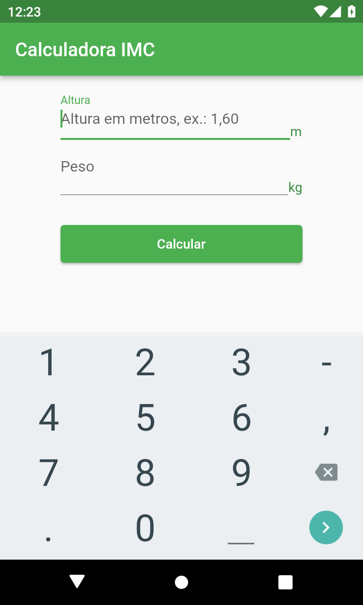
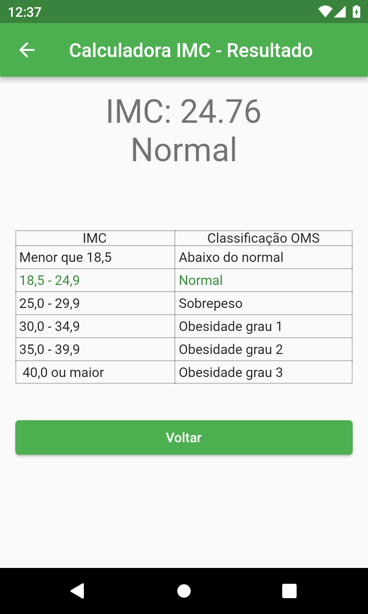

# Flutter

Alguns projetos simples criados em Flutter:

## [Contador Com Provider](/counter_provider/)

## [Calculadora IMC (com Provider)](/imc/)
 &emsp;&emsp; 

## [HTTP Status](/http_status/)
 &emsp;&emsp; 
